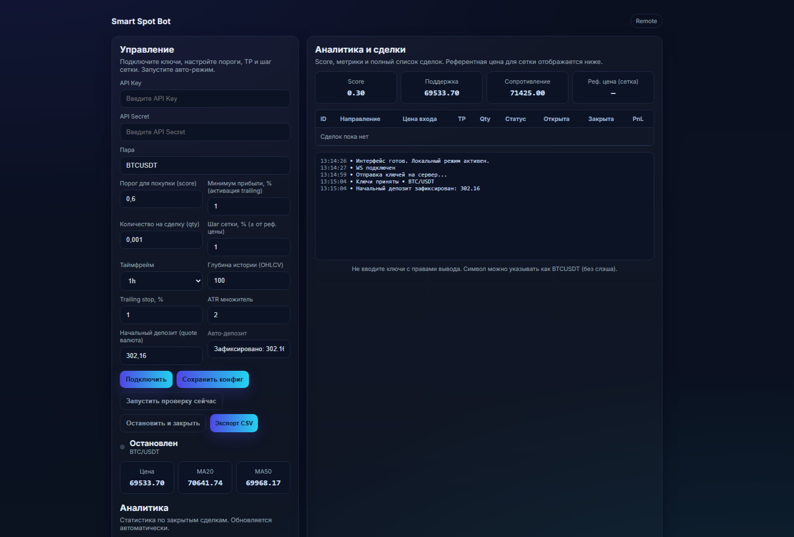

# Smart Spot Bot — Торговый бот с веб-интерфейсом

Автоматический спот-бот для Bybit: входы по рынку с фильтром MA20 и сеткой, выходы по trailing/ATR-стопам.  
Расчёт индикаторов, аналитика сделок и уведомления.
  
**Основные возможности:**
- Индикаторы: MA20/MA50, RSI, тренд, CVD, уровни Pivot  
- Входы: по рынку с фильтром (MA20, RSI), сетка доливок (±1%)  
- Выходы: trailing stop (+1% от входа), ATR-стоп (x2), удержание по MA50  
- Аналитика: winrate, avg pnl, max drawdown, total pnl, ROI  
- Персистентность: сделки/конфиг в JSON  
- Экспорт истории в CSV  
- Уведомления: Telegram при ошибках  
- Dry-run: симуляция без реальных ордеров  

**Технологии:**
- Backend: Python, FastAPI, ccxt (Bybit), numpy  
- Frontend: HTML5, CSS, JavaScript, WebSocket  
- Логи: logging + Telegram-handler  

## Как запустить локально

1. Склонируй репозиторий  
   ```bash
   git clone https://github.com/klimyalta/smart-spot-bot.git
   cd smart-spot-bot
